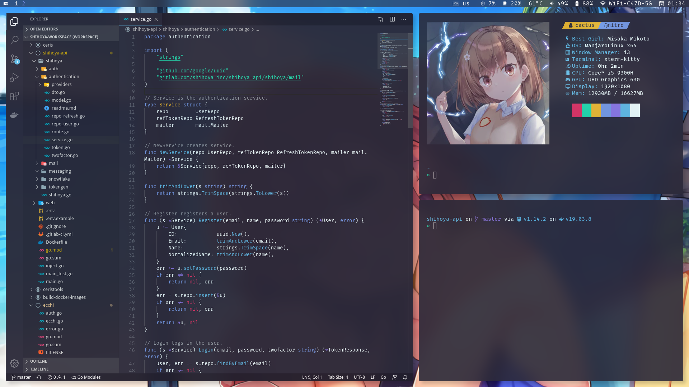

CactusBlue's dots
=================

How to use
----------

Following packages are required:
- i3wm resloved fork (Rounded corners)
- Picom tryone fork (Frosted glass effect)
- Kitty
- zsh + oh-my-zsh + spaceship
- Polybar

Install with `dotdrop`.

# Screenshots
